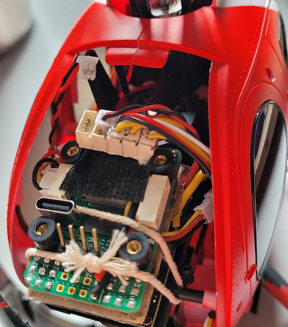
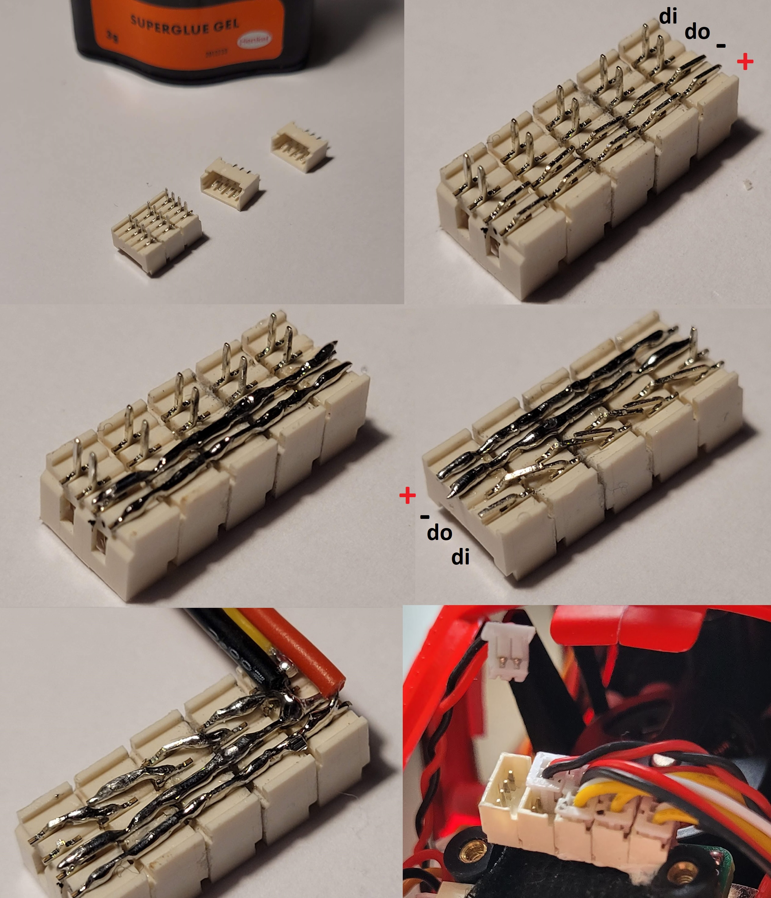

#  Getting started with LEDs

## Introduction to LED strips

Rotorflight supports up to 32 individually addressable WS2811/2812 RGB LEDs. You can control them with just one data pin, and set the brightness and color of each LED individually. LEDs can have different functions, for example display a color, visualize warnings or battery state, or just blink. This walk-through will show you how to set up a simple LED strip with some scale lights.

<iframe width="560" height="315" src="https://www.youtube.com/embed/GB6hGU9MKpI" title="YouTube video player" frameborder="0" allow="accelerometer; autoplay; clipboard-write; encrypted-media; gyroscope; picture-in-picture; web-share; fullscreen" allowfullscreen></iframe>

Each LED has 4 pins: 5V, ground, *data in* and *data out*. The FC should be connected to *data in* of the first LED. *Data out* of the first LED should be connected to *data in* of the second LED. And the *data out* of the second LED should again be connected to *data in* of the third LED. And so on.

There are ready made WS2812 strips with 30, 60 or 144 LEDs per meter. That's great for testing or maybe on the boom for some night flying, but there are also more conventional WS2811 5mm and 8mm LEDs available. Those are more suited for scale lighting.

There are quite a lot of tutorials/videos for Betaflight, and Rotorflight supports all the functions of Betaflight 4.3. In addition, Rotorflight supports *scale lights*, with which you can program anti-collision lights, strobe lights or landing lights. Here we'll focus on those scale lights.

## Create a LED_STRIP resource

In order to use a LED strip, you'll need a LED_STRIP resource to which you can connect your LEDs. A LED_STRIP resource requires a timer and DMA should be enabled.

Some FCs might already have a LED_STRIP resource and then you can just use that pin. But if you want to use another pin on your FC, or if your FC doesn't have a LED_STRIP resource, you'll need to do some [resource remapping](#remapping-to-led_strip). For this walk-through I'm going to use the Radiomaster Nexus, so go to the CLI and [remap TX6 to LED_STRIP](#radiomaster-nexus).

Now go to the *Configuration* tab and enable *LED_STRIP* under *Features*. Press *Save and reboot*.

## Testing hardware

A piece of LED strip is ideal for testing. I'll be using one with 3 LEDs connected to Port B on the Nexus. Wiring is simple: just connect 5V, ground and LED_STRIP (formerly known as TX6) to the strip.


## The *LED Strip* tab

Now go to the *LED Strip* tab. Note that this tab will only be visible if you have the *LED_STRIP* feature enabled under *Configuration*.

We're going to define:
- a green navigation light that also functions as a strobe
- a red ACL light that slowly blinks
- a white landing light that can be operated from the TX.

Connect the Nexus to the Configurator using USB. 5V will now be available on port A, B and C. If you're using many LEDs, consider using an external 5V power supply.

### Define the 3 LEDs
- Click on *Wire Ordering Mode*. The 16x16 matrix will become greenish.
- Select a square in the matrix. A '0' should now be displayed in it.
- Select *Color* as *Function*
- Now select another square in the matrix. A '1' should now be displayed in it.
- Select *Color* again as *Function*
- Select yet another square in the matrix. A '2' should now be displayed in it.
- Select *Color* as *Function*
- Press *Save*

Your screen might now look like this, although the actual position of the three squares will likely be different:


### Create the green navigation light
- Select the square with '0' in it
- In the color palette, left-click on green. The LED should now light up.
- If you find the LED too bright, adjust the overall LED brightness under *LED Strip Global Settings*
- Enable *Blink* and set one checkmark. The LED wil now shortly turn off (=black).
- In the color palette, right-click on white. Now the LED will shortly flash a white light.
- Press *Save*

### Create the red anti-collision light
- Select the square with '1' in it
- Select *Blink* and set some check marks next to each other
- Right-click the red color. The second LED should now flash red
- Press *Save*

### Create the white landing light
- Select the square with '2' in it
- Enable the *Fade to alt color* feature
- Left-click white. The LED should now light up
- Select *Status Alt* next to *Profile*, under *LED Strip Global Settings*. The LED should now dim.
- Set *Fade rate* to 10 to dim slowly
- Press *Save*
- You can use *Adjustments* to switch the LED profile from your transmitter. It might look something like:


Here's another video showing the techniques used in this Quick Start on a Walkera 4F200LM, for which I used two 3mm and four 5mm LEDs.

<iframe width="560" height="315" src="https://www.youtube.com/embed/72LsrcEJEK0" title="YouTube video player" frameborder="0" allow="accelerometer; autoplay; clipboard-write; encrypted-media; gyroscope; picture-in-picture; web-share; fullscreen" allowfullscreen></iframe>

## Molex PicoBlade bus

Here's a simple bus system for connecting individual LEDs using 4-pin Molex PicoBlade connectors. It can be used for connecting individual WS2811/2812 LEDs as well as conventional LEDs.



Conventional LEDs should come after the WS2811/2812 LEDs since they don't support *data in* and *data out*. Also, you can use 2-pin PicoBlade connectors for them.

### Building the PicoBlade bus

- Glue some 4-pin PicoBlade headers together
- Bend the pins for 5V and GND so they form two rails
- Carefully solder the 5V and GND rails
- Bend the *data out* pin of the first header to the *data in* pin of the second header and repeat
- Solder the *data out* pins to the next *data in* pins
- Connect wires for 5V, GND and *data in* to the bus
- Isolate the bottom of the bus with hot glue or epoxy
- Connect the bus to the FC



## Remapping to LED_STRIP

### Radiomaster Nexus

On the Nexus Port B is the best choice for creating a LED_STRIP resource. Port B provides RX6 and TX6 by default. To remap TX6 to LED_STRIP, enter the following in the CLI:

```
resource SERIAL_TX 6 NONE
resource LED_STRIP 1 C07
timer C07 AF3    # TIM8, default is also AF3
dma pin C07 0    # default is NONE
save
```

Note that although we remapped TX6, RX6 is still there and functional.

Alternatively you can remap RX6 to LED_STRIP:

```
resource SERIAL_RX 6 NONE
resource LED_STRIP 1 C06
timer C06 AF3    # TIM8, default is also AF3
dma pin C06 0    # default is NONE
save
```

### FlyDragon F722

The FlyDragon F722 has a built in LED 'strip' with just one LED. It has the [Warning overlay](../../configurator/tabs/led_strip.md#warning) enabled by default and is connected to the FC using pin B08. However, the *data out* pin of that LED isn't exposed, so you have to remap some other port to LED_STRIP to make use of your own LEDs. There are several options: SCL, SDA, RPM-S and F.Port. SCL and SDA are located on the GPS port, which also provides 5V. Using SCL or SDA is preferred because they can have their own dedicated timer.

#### 1. Remap SCL to LED_STRIP

To remap SCL to LED_STRIP, enter the following in the CLI:

```
resource I2C_SCL 1 NONE
resource LED_STRIP 1 B06   # default is B08
timer B06 AF2              # TIM4
dma pin B06 0
save
```

#### 2. Remap SDA to LED_STRIP

To remap SDA to LED_STRIP, enter the following in the CLI:

```
resource I2C_SDA 1 NONE
resource LED_STRIP 1 B07   # default is B08
timer B07 AF2              # TIM4
dma pin B07 0
save
```

#### 3. Remap RPM-S to LED_STRIP

RPM-S isn't connected to VBec and supplies 5V, which is all right for a couple of LEDs.

To remap RPM-S to LED_STRIP on the FlyDragon V2 or V2.2, enter the following in the CLI:

```
resource LED_STRIP 1 A15   # default is B08
timer A15 AF1              # TIM1
dma pin A15 0
save
```

To remap RPM-S to LED_STRIP on the FlyDragon V1, enter the following in the CLI:

```
resource LED_STRIP 1 A08   # default is B08
timer A08 AF1              # TIM1
dma pin A08 0
save
```

#### 4. Remap F.Port to LED_STRIP

Be careful: F.Port uses VBec, which might be too high for your LEDs. Most LEDs require 5V.

```
resource LED_STRIP 1 A02   # default is B08
timer A02 AF1              # TIM2
dma pin A02 0
# Change motor 1 timer from TIM2 to TIM5
timer A00 AF2
save
```

### Flywing HELI405

You can remap SBUS to LED_STRIP on the Flywing HELI405. To do this, enter the following in the CLI:

```
resource SERIAL_RX 2 NONE
resource LED_STRIP 1 A03
timer A03 AF2
dma pin A03 1
save
```
