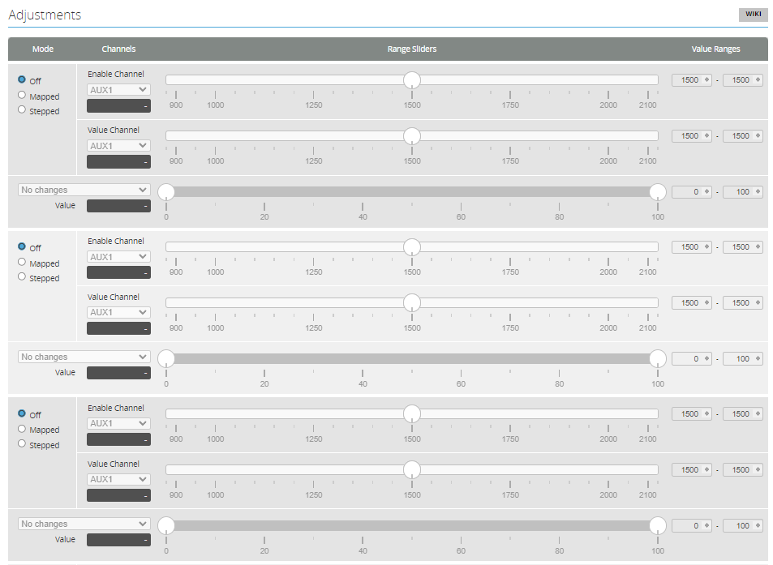
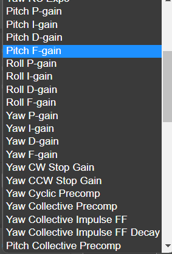
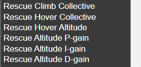

# Adjustments

There are total 32 adjustment slots, each assigning an AUX channel to a configuration parameter or a special function. An adjustment slot consist of an enabling condition, an adjustment function, and parameter limits.

The enabling condition is an AUX channel, which must be within the configured range for the slot to be active. Once active, a control AUX channel will cause a parameter value adjustment, based on the selected adjustment function.

Any changes are taking effect immediately, and are saved in the configuration.

## Example - Select a Profile In-Flight

Being able to switch between profiles in-flight allows you to use different head-speeds with differently tuned PIDs. It can also help with PID tuning, since it makes A/B testing possible with the flick of a switch.

### Simple example

Here we use only one channel -AUX4- for *PID* and *Rates* Profiles Selection. Assign AUX4 to a 3-position switch on the TX, so that the switch outputs 1000/1500/2000us. [Profile Switching Example](../../setup/Profile-switching-example.md).

## Adjustment Types

There are two ways the how the control AUX channel is affecting the configuration parameter.

### Step Adjustment

The control AUX channel can be a three position switch or a trim switch on the transmitter. While in up position, it will cause the adjustment to increase by step size, and vice versa. The min and max limits are adhered.

Step adjustment is enabled by setting the step size to non-zero value.

### Continuous Adjustment

The control AUX channel is a full resolution RC channel, and is controlling the configuration parameter directly. The RC channel range 1000us..2000us is stretched to cover the parameter range min..max.

Continuous adjustment is enabled by setting the step size to zero.

## Adjustment Functions

The adjustment function assigns the control AUX channel to a configuration parameter or a special function. The supported functions are listed below.

    **Profile change**  
  

    **Rates**  
  

    **PID**  
      

    **Gyro cutoffs**  
  

    **Dterm cutoffs**  
  

    **Rescue**  
  

    **Leveling**  
  

    **Governor**  
  

    **Boost gains**  
  

    **Offset gains**  
  

    **Cross-coupling**  
  

    **Accelerometer trims**  
  

### Parameter Change Functions

The parameter change functions are adjusting the associated configuration parameters, taking effect immediately. This allows changing the fundamental tuning parameter inflight.

Each parameter has a min and max limit that the user can set to safeguard against unreasonable or unsafe values. In addition, the system has absolute limits for each parameter.

### Profile Change Functions

The special functions to change configuration profiles works exactly the same as the parameter functions, except that the possible values are limited to the number of profiles. Both step and continuous adjustments can be used.

For example, there are six Rate Profiles available, thus the parameter limits should be min = 0 and max = 5. Narrower range is also possible, if so desired.

