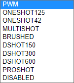
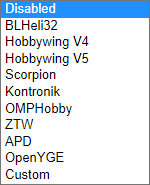
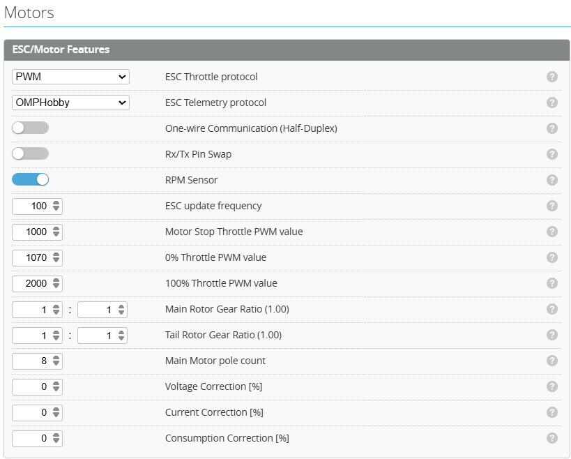
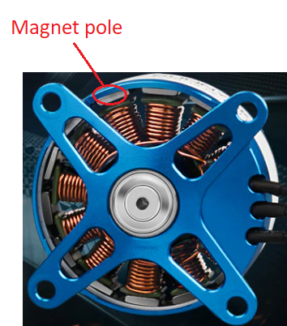

# Motors

The *Motors* tab is used to configure the ESC communications protocols **( Motor Control Protocol & Telemetry Protocol )** ,as well as to provide the ability to test motor operation. Depending on the selected ESC protocol and selected Rotorflight features, you might need to specify some other parameters as well.

:::info
This section is about Rotorflight communicating with the ESC. The settings for your motor (such as timing, braking and motor update frequency) can only be set in your ESC, and not in Rotorflight.
:::

## ESC/Motor Features

### ESC Throttle Protocol

Set the ESC protocol required for your ESC under *ESC/Motor protocol*. Usually this would be *PWM* or *DSHOT300*.

### ESC Telemetry Protocol

Set the ESC [*Telemetry*](../../setup/ESC-Telemetry.md) protocol if your esc supports it.

### PWM Protocol
Most RC helicopter ESCs manufacturers (e.g. Hobbywing, YGE, Scorpion ,or Castle) use [PWM](https://en.wikipedia.org/wiki/Servo_control), an analog protocol.

**RPM Sensor:** Activate the RPM Sensor input for motor RPM, you can connect an RPM signal from the ESC, or from an external RPM sensor device.

:::note
A correct RPM measurement is crucial to the operation of *RPM_FILTER* and *GOVERNOR* features, therefore ensure that you have a correct RPM measurement setup. 

The FC also needs to know the [RPM](../../setup/Rpm-Measurement.mdx) of the main rotor, and the tail rotor. For this you have to exactly specify the *Motor pole count* and the *Gear ratios*.

With this info, the FC can calculate the:

- Main motor RPM = eRPM / (motor pole count / 2)
- Main rotor RPM = Main motor RPM / ( main gear tooth count / main motor pinion tooth count )
:::

**ESC Update Frequency:** the PWM update frequency for your ESC. Usually between 50-400Hz.

**Disarm Throttle PWM value:** the value that is sent to the ESC when the craft is disarmed. It should stop the motors. Usually 1000µs.

**0% Throttle PWM value:** the value that is sent to the ESC when the craft is armed and at 0% throttle. Usually 1070µs.

**100% Throttle PWM value:** the value that is sent to the ESC when the craft is armed and at full throttle. Usually 2000µs.

### DSHOT Protocol
Most drone ESCs support DSHOT, a digital protocol.

If you use DSHOT, use either DSHOT150 or DSHOT300. DSHOT600 is not recommended. Also make sure that the main motor isn't actively being braked by the ESC, especially if you don't have a [one way bearing](https://youtu.be/ahWzhT5Bn28) on the main shaft.
- BLHeli_32: set *Non Damped Mode* to *On* on the main motor ESC
- Bluejay: set *Maximum Breaking Strength* to *0*

#### DShot RPM Telemetry 
This switch is only visible when the *ESC/Motor protocol* is DSHOTxxx. It enables motor eRPM telemetry on supported ESCs via [bidirectional DSHOT](../../setup/Rpm-Measurement.mdx#bi-directional-dshot) and can be used to facilitate the *GOVERNOR* and/or *RPM_FILTER* features. If you use bidirectional DSHOT you don't have to use a frequency sensor for obtaining the eRPM of the motor(s).

### Gear Ratio Configuration

Enter the number of teeth for the main rotor gearing [Teeth on Pinion gear]/[Teeth on Main Gear]. For a direct drive Main rotor this is just set to 1 / 1.

Enter the number of teeth for the Tail rotor gearing [Teeth on Tail gear]/[Teeth on Autorotation Gear]. For a direct drive tail this is just set to 1 / 1.

:::tip
If the gear tooth count is not known, you can approximate the gear ratio instead.

For example if the main gear ratio is 11.8 then you set *[Teeth on Pinion gear =10]/[Teeth on Main Gear =118]*.

Similarly if the tail gear ratio is 4.8 then you set *[Teeth on Tail gear =10]/[Teeth on Autorotation Gear =48]*.

note that counting the gear tooth is preferable because an accurate gear ratio is essential to the operation of the [RPM Filters](../../setup/RPM-Filters.md).
:::

:::note
For Helicopters with two-stage reduction, kindly read the [Two-Stage Gear Train WalkTrough](../../setup/Two-Stage-Gear-Train-Ratios.md)
:::

### Motor Pole Count
Determine the number of magnetic poles for each motor. Count the number of magnets on the motors rotor. In the example below the magnets (circled) are fixed to the outer bell which in total has 14. This allows the flight controller to know how many electrical phase rotations are required to complete one physical motor revolution.

## [Governor Features](../../setup/Governor.md#governor-mode)

## Motor Override
Motor Override functionality is provided to test the operation of each motor directly. This functionality will make the motors spool up. Do this WITHOUT the main or tail rotors fitted!

Throttle - This is the command being sent from the flight controller to the ESC.

RPM - The measured RPM telemetry feedback. As the motor spins this should read a value related to the current speed.

Errors (only with DSHOT) - This shows the status of the RPM telemetry signal. This should be 0%.

::::note Slider
If you use the slider, make sure you release the mouse button. Nothing changes as long as you hold the mouse button down!
::::

::::note BLHeliSuite32
The Test motors function in BLHeliSuite32 doesn't work when using Rotorflight. It will give an error like 'Initialization of Motor Test Mode failed! Please check current Unknown rev 4.3.0 support for this application function!'.
::::
