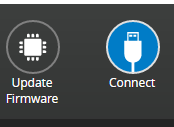
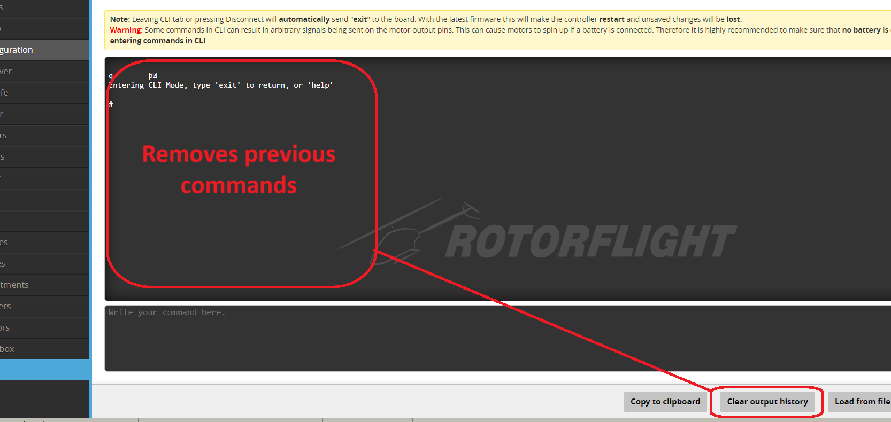
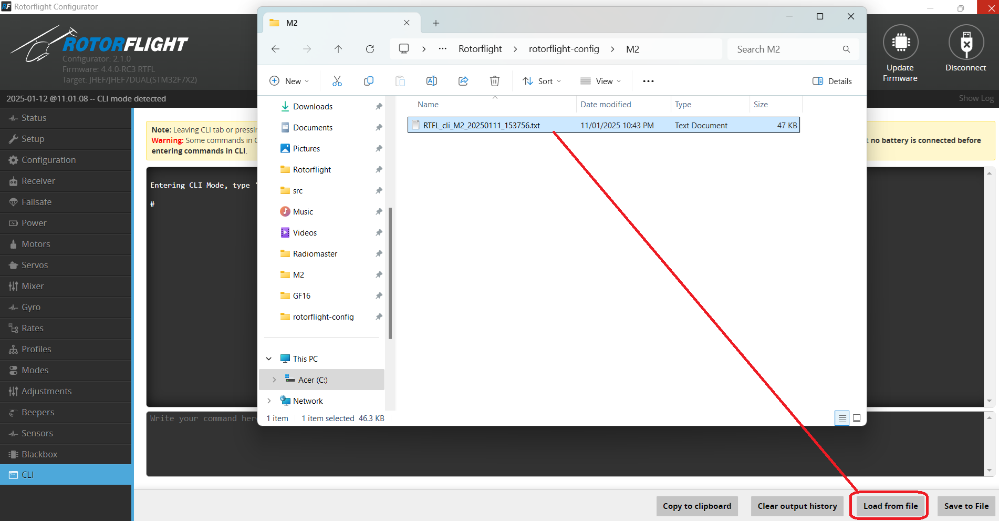
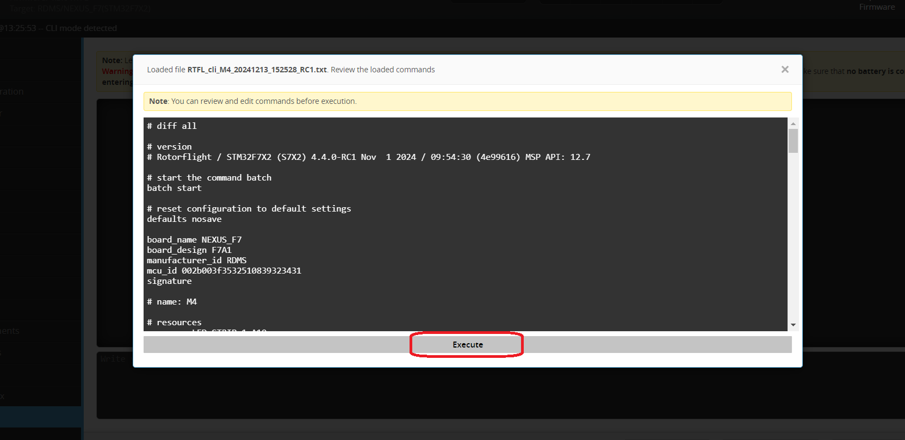
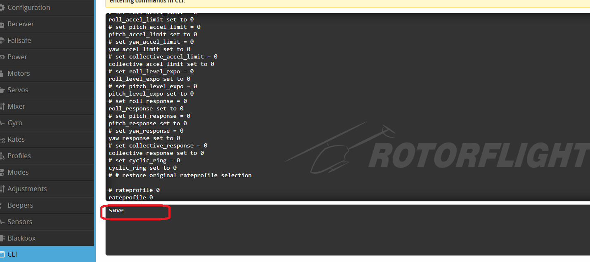

# Backup and restore
## Back up the configuration
Backups of your Rotorflight configuration can be taken in order to restore a controller to a previous state, in the event of a failure, or to duplicate your controller to use on another helicopter. Also it is advised that a backup is taken of the original Betaflight pre-loaded configuration before loading Rotorflight. 

### Step 1.

Open Rotorflight Configurator and **_[Connect]_**. If the board is new and as supplied with Betaflight a warning message will pop up saying the _"firmware version is not supported"_. This means that the board currently does not have Rotorflight loaded so it can be safely ignored. Rotorflight configurator will now open in CLI mode. If you are backing up your config after having already configured your helicopter you will need to click on the CLI tab from the left hand side of the page to open the CLI interface.

### Step 2. 
Choose what you want to back up. There are several options. 

* `dump`
This command dumps all of the hardware and software configuration. for the current PID and rate profiles.  
* `dump all`
Dump all downloads all hardware and software the same as the dump command; however, it also includes all PID and rate profiles.  
* `diff`
diff will download any configuration that is not equal to the custom defaults for that board. Things like your ESC protocol, RX type etc. This file is very small.  
* `diff all` 
Will do the same as **diff** above, but including all PID and rate profiles.
* `dump hardware`
Dump hardware will only show the hardware config. This is information like the pin assignments and board specific information (gyro bus address etc).  

### Step 3.
* Click on **_[Clear output window]_**. This removes any previous commands so they are not captured in your backup.  

 
* Type the backup command (from step 2) in the window and click **_[ENTER]_**.  
  

### Step 4.

After the command is complete click **_[Save to File]_** and store on your computer.  

## Load/Restore Config
Use this process to load remapping config files for your specific flight controller if available.
You can also restore config files to your flight controller you have previously saved or have been shared by other users. 

### Step 1.

* Open the CLI tab and click **_[Load from File]_** and select the file on your computer.  

### Step 2.
* Click on the **_[Execute]_** from the pop up.

  
### Step 3.

Once the backup is loaded type **save** in the command line and **_[ENTER]_**. The flight controller will now reboot.
