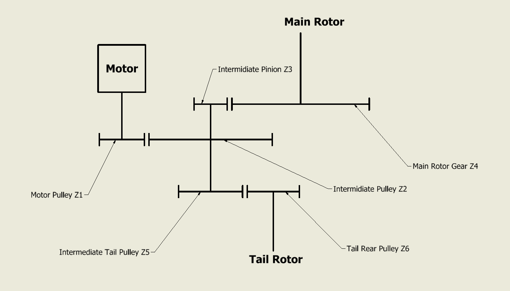
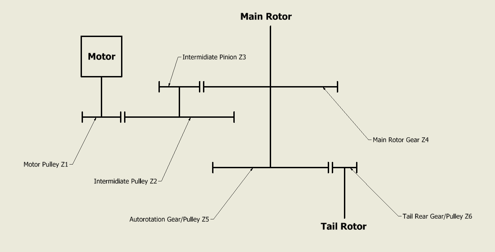

# Two-Stage Gear Train Ratios

Having an accurate gear ratio for the main and tail rotor is essential for Rotorflight accurate RPM Filters performance.

Therefore it is best to count the tooth on the main and tail gear/pulley reduction sets and enter the values into the configurator.

This is relatively easy in single stage drive train that are used on most helicopters.

:::note
You can use the online spreadsheet to easily get the calculated Tooth Counts for Common Helis.

The Spreadsheet is accessible using the below link: 

* Please 'make a copy'. 

[Two-Stage Gear Train Ratios](https://docs.google.com/spreadsheets/d/1PmYWWJfdmIFtDW_hZc1i-MhdTOnUqErDWB5Yag176pk/edit?usp=sharing)
:::

## SAB Style Two-Stage Gear Train

The SAB Goblin helis have a two-stage transmission, therefore you have double the amount of gears/pulleys, also the main tail pulley is mounted on the intermediate shaft, which make the tail ratio a little more complicated to determine.

The above pictures shows the configuration of the transmission on the SAB Raw 580, 700, Piuma, Black Thunder 700, etc.

The gears/pulleys tooth count is marked by Z, and is numbered to identify each one.

For the main ratio, Rotorflight requires you to enter the `motor pinion` and `main gear` tooth count respectively in the two fields of the *Main Rotor Gear Ratio* line.

Based on the above picture, enter `motor pinion` value as **(Z1 x Z3)** and `main gear` value as **(Z2 x Z4)**.

For the tail ratio, Rotorflight requires you to enter the `tail pulley` and `front pulley` tooth count respectively in the two fields of the *Tail Rotor Gear Ratio* line.

Also based on the above picture, enter `tail pulley` value as **(Z3 x Z6)** and `front pulley` value as **(Z4 x Z5)**.

The below table shows some gear/pulley tooth counts for some famous two-stage helicopters.

| Heli Model | Z1 (Motor Pulley) | Z2 | Z3 | Z4 | Z5 | Z6 (Tail Pulley) |
|--|--|--|--|--|--|--|
|SAB Goblin 500 Sport | 15 to 24 ( Std 18T ) | 48 | 18 | 62 | 28 | 21 |
|SAB Black Thunder 700 | 18 to 25 ( Std 21T ) | 60 | 19 | 68 | 37 | 26 |
|SAB Raw 580 | 18 to 26 ( Std 22T ) | 50 | 14 | 58 | 27 | 23 |
|SAB Raw 580 Nitro | 26 to 28 ( Std 26T ) | 50 | 14 | 58 | 27 | 23 |
|SAB Raw 700 | 18 to 25 ( Std 21T ) | 56 | 18 | 69 | 34 | 26 |
|SAB Raw 700 Nitro | 26 to 28 ( Std 27T ) | 52 | 14 | 58 | 27 | 22 |
|SAB Raw Piuma | 18 to 26 ( Std 20T ) | 52 | 14 | 58 | 27 | 22 |
|SAB ilGoblin 700 RAW/PRO | 18 to 25 ( Std 21T ) | 56 | 18 | 68 | 34 | 26 |

For example for the Raw 700 with STD 21T motor pulley, the calculation will be as follow:

* `motor pinion` = *(Z1 x Z3)* = *(21 x 18)* = `378`.
* `main gear` = *(Z2 x Z4)* = *(56 x 69)* = `3864`.
* `tail pulley` = *(Z3 x Z6)* = *(18 x 26)* = `468`.
* `front pulley` = *(Z4 x Z5)* = *(69 x 34)* = `2346`.

After entering the value the ratios in the configurator motor page should look like this.

## KDS Style Two-Stage Gear Train

The KDS Agile helis also have a two-stage transmission, however the autorotation gear/pulley is mounted on the main shaft, thus the tail ratio calculation will be straightforward.

The above pictures shows the configuration of the transmission on the KDS Agile 5.5, 7.5, A5, and A7.

For the main ratio, Rotorflight requires you to enter the `motor pinion` and `main gear` tooth count respectively in the two fields of the *Main Rotor Gear Ratio* line.

Based on the above picture, enter `motor pinion` value as **(Z1 x Z3)** and `main gear` value as **(Z2 x Z4)**.

For the tail ratio, Rotorflight requires you to enter the `tail pulley` and `front pulley` tooth count respectively in the two fields of the *Tail Rotor Gear Ratio* line.

Also based on the above picture, enter `tail pulley` value as **Z5** and `front pulley` value as **Z6**.

The below table shows some gear/pulley tooth counts for these KDS helis.

| Heli Model | Z1 (Motor Pulley) | Z2 | Z3 | Z4 | Z5 | Z6 (Tail Pulley) |
|--|--|--|--|--|--|--|
|KDS Agile A5 | 20 or 21 ( Std 21T ) | 54 | 17 | 66 | 54 | 14 |
|KDS Agile 7.2 | 19 to 21 ( Std 19T ) | 54 | 20 | 66 | 57 | 12 |
|KDS Agile A7 | 19 to 21 ( Std 20T ) | 54 | 20 | 66 | 57 | 12 |

For example for the KDS Agile A7 with STD 20T motor pulley, the calculation will be as follow:

* `motor pinion` = *(Z1 x Z3)* = *(20 x 20)* = `400`.
* `main gear` = *(Z2 x Z4)* = *(54 x 66)* = `3564`.
* `tail pulley` = *Z6*  = `12`.
* `front pulley` = *Z5* = `57`.

After entering the value the ratios in the configurator motor page should look like this.

