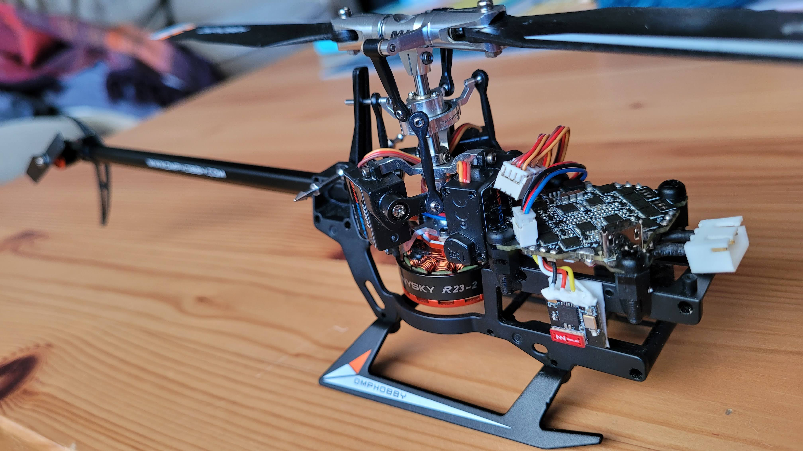
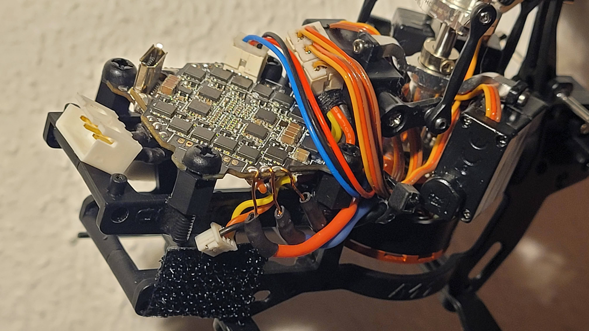
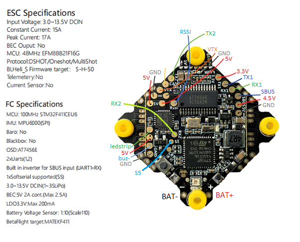

# DIY board - Betaflight FC

Rotorflight is a fork of the popular Betaflight project commonly used for drones. This means that all of the drone boards designed for Betaflight are also compatible with Rotorflight. Drones most commonly use 4 motors and do not have servos so we need to do some additional configuration to add these items (as shown below).

### Flashing Rotorflight


[Flashing Rotorflight firmware](../setup/flashing-the-firmware.mdx)

### Remap Betaflight board

[Remapping servos and motors](../setup/remapping.mdx)

# Example: M1 with DarwinFPV 15A

The OMPHOBBY M1 is a small double brushless helicopter with an all-up weight of about 120g. The stock FC is so-so and has some peculiarities, such as a huge deadband around center and a tail that sometimes [spins volatile](https://www.youtube.com/watch?v=q4H1CzN1pPY).

It's fairly easy to replace the stock FC and ESC with an AIO whoop board. Here we're using the [DarwinFPV 15A](https://darwinfpv.com/products/darwinfpv-15a-1-3s-f411-ultralight-whoop-aio).
- It's able to do 15A continuously with peaks of 17A, which should be enough for the main motor.
- It also has a 2A 5V BEC, which is plenty for the servos.
- There are enough connections (pads) for the servos, ELRS and -optional- an [OpenLager](../setup/openlager.md) blackbox logging device.

The receiver used here is a [BETAFPV ELRS Lite](https://betafpv.com/products/elrs-lite-receiver).



There's also a DarwinFPV 15A with built-in ELRS receiver, but we can't use that version since it uses SPI - which isn't supported by Rotorflight.

## Build notes

- The AIO is mounted to the M1 frame with some plastic M3 spacers and screws. The spacers are glued to the M1 frame with some epoxy, after cutting the thread underneath them slightly to make a perfect fit.
- The servo connectors are three Molex PicoBlade connectors glued together (similar to [this bus](../setup/led-strip-quick-start#building-the-picoblade-bus)), then connected to the FC using 5 wires (5V/GND using 28AWG, S1/S2/S3 with 30AWG). The underside of the bus is reinforced and insulated with epoxy.
- None of the servo or tail motor wires are modified, and only the copper connectors on the main motor wires were removed.
- All wires soldered to the PCBs are secured with some electronics-friendly silicon glue, which will reduce the risk of solder joints breaking or wires loosening during flight.
- The ESCs were flashed with [Bluejay](../setup/blheli_s-to-bluejay) version 0.21, so we can use bi-directional Dshot with RPM telemetry for filtering and governing.
- The pre-soldered capacitor on the DarwinFPV 15A has been removed.

Here's a view from the left:



The OpenLager can be placed on the velcro, and also uses a Molex PicoBlade connector.

## Resource mapping

Here's the resource mapping used for this build.

```
resource MOTOR 1 B07   # main motor on M4
resource MOTOR 2 B04   # tail motor on M1
resource MOTOR 3 NONE
resource MOTOR 4 NONE
resource SERVO 1 A00   # RSSI
resource SERVO 2 B03   # S5
resource SERVO 3 A08   # LED strip
resource LED_STRIP 1 NONE
```

And here's an overview of the pads on the DarwinFPV 15A:



ELRS is on RX1/TX1/4.5V (so it also powers up when connecting USB), OpenLager is on TX2.

Here's the complete [`diff all`](./img/m1-diff-all.txt).
