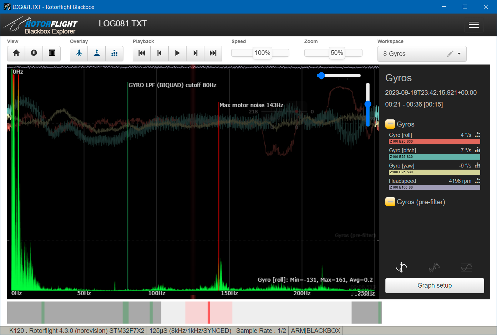
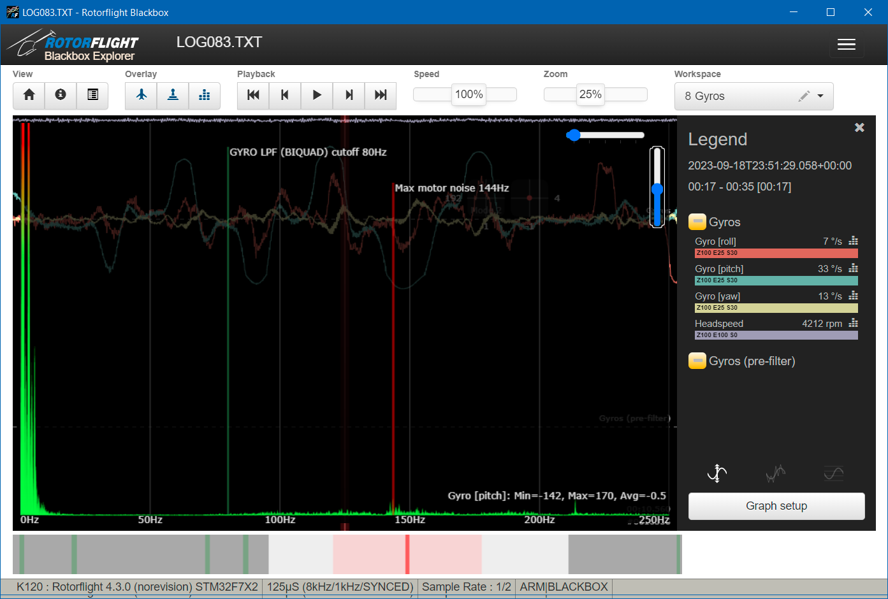

# RPM Filters

## Introduction

RPM filters clean up the gyro signals by filtering out vibrations that are coming from the rotating parts in a helicopter: the main rotor, tail rotor and motor(s). These vibrations are seen as noise in the gyro signal. Removing these vibrations (noise) results in a cleaner signal which is more representative of the physical movement of the helicopter. A cleaner signal is much better for the controller to operate from.

Nothing comes for free. Filters result in a cleaner signal at the expense of lag. The filtered signal is slightly slower than the original. This means to have the most responsive controller we should minimise the filters used.

## Dynamic filters

Dynamic filters will filter the gyro signal when an [RPM measurement](rpm-measurement.mdx) is not available or it is not accurate. These are not as capable as the RPM filters. These can be used if

- No RPM signal available - Helicopters that do not have an RPM input or bi-directional dshot.
- Autorotations - In this case the RPM measurement is not correct due to the one way bearing. You may wish to enable 2 notches to account for this.

## RPM Filters

## Filter Tuning

Make a blackbox log of a short flight with constant headspeed. Scroll to the point where the heli has spooled up and is hovering. Mark that point with the `I` key. Scroll near the end and mark that with the `O` key. Now bring up the _Analyzer Display_ and enlarge it. It might look like:

This log was made with only a double fundamental filter. As you can see there's some noise around 144Hz. Since the headspeed is 4200 RPM, that must be near the second harmonic (4200/60 = 70\*2 = 140Hz). Also note that the gyro signal in the background is also a bit noisy.

Now let's add some single filters for the 2nd (140Hz) and 3rd (210Hz) harmonic. Suddenly the log looks a lot cleaner:

